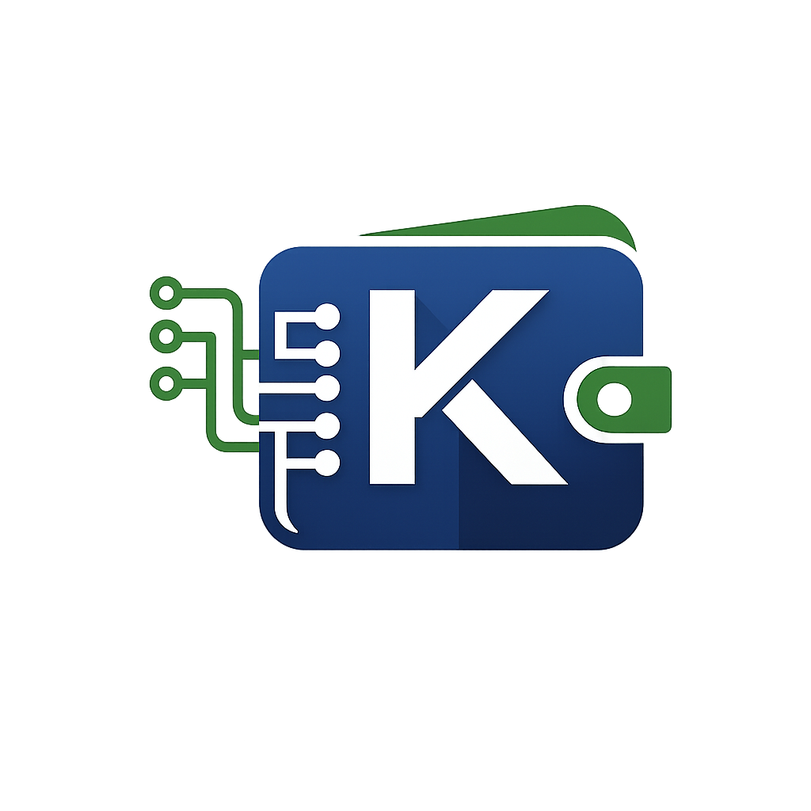
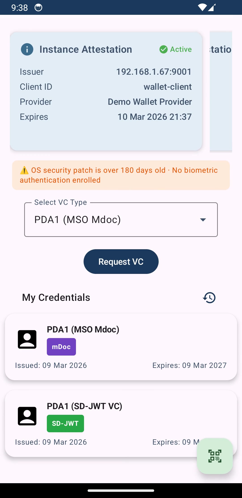

<p align="center">
  
</p>

# K-Wallet — SD-JWT, mDoc & VCI/VP Demo
Explore how SD-JWTs, mDoc (ISO 18013-5), OIDC4VCI, and OIDC4VP enable user-consented, selective disclosure of Verifiable Credentials using open standards in a demo setup. The wallet implements wallet attestation (WIA/WUA), DPoP-bound tokens, and HAIP-compliant verifiable presentations, following the [HAIP (High Assurance Interoperability Profile)](https://openid.net/specs/openid4vc-high-assurance-interoperability-profile-1_0.html) specification and EUDI Architecture Reference Framework.

Related articles:
- [Verifiable Credentials with Spring Boot & Android](https://dzone.com/articles/verifiable-credentials-spring-boot-android)
- [Securing Verifiable Credentials with DPoP](https://dzone.com/articles/securing-verifiable-credentials-with-dpop-spring-boot)
- [HAIP 1.0: Securing Verifiable Presentations](https://dzone.com/articles/haip-1-0-securing-verifiable-presentations)
- More articles covering WIA, WUA, and Token Status List coming soon.

## Features

| Feature | Description |
|---------|-------------|
| **WIA** | Obtains Wallet Instance Attestation from the wallet-provider and presents it at PAR/Token endpoints via `attest_jwt_client_auth` |
| **WUA** | Obtains Wallet Unit Attestation backed by Android Key Attestation (TEE/StrongBox) for hardware key security |
| **PAR** | Uses Pushed Authorization Requests before initiating the Authorization Code Flow |
| **DPoP** | Generates DPoP proofs to sender-constrain access tokens (RFC 9449) |
| **HAIP VP** | Verifies JAR signatures (x5c), validates `x509_hash` client_id, encrypts VP responses (ECDH-ES + A256GCM) |
| **DCQL** | Parses Digital Credentials Query Language requests for selective disclosure |
| **dc+sd-jwt** | Issues and presents credentials in HAIP-compliant format with x5c header |
| **mso_mdoc** | Issues and presents mDoc credentials (ISO 18013-5) with COSE_Sign1 IssuerAuth and DeviceAuth |
| 🆕 **Transaction Log** | On-device audit log of issuance, presentation, and deletion events per [ARF 2.8.0 Topic 19 (DASH)](https://github.com/eu-digital-identity-wallet/eudi-doc-architecture-and-reference-framework/blob/main/docs/annexes/annex-2/annex-2.02-high-level-requirements-by-topic.md#a2312-topic-19---user-navigation-requirements-dashboard-logs-for-transparency) — attribute identifiers logged, never values (DASH_03a) |
| 🆕 **Export / Import** | AES-256-GCM encrypted wallet backup (`.kwallet`) via Android SAF per [ARF 2.8.0 Topic 34 (Migration Objects)](https://github.com/eu-digital-identity-wallet/eudi-doc-architecture-and-reference-framework/blob/main/docs/annexes/annex-2/annex-2.02-high-level-requirements-by-topic.md#a2321-topic-34---migrate-to-a-different-wallet-solution) — no raw credentials or private keys exported |
| 🆕 **App Check** | Firebase App Check (Play Integrity API) verifies wallet genuineness on every Wallet Provider call per [ARF 2.8.0 WIAM_04](https://github.com/eu-digital-identity-wallet/eudi-doc-architecture-and-reference-framework/blob/main/docs/annexes/annex-2/annex-2.02-high-level-requirements-by-topic.md#a2323-topic-40---wallet-instance-installation-and-wallet-unit-activation-and-management) |
| 🆕 **Security Posture** | 4-level device posture framework per [ARF 2.8.0 §6.5.4.2](https://github.com/eu-digital-identity-wallet/eudi-doc-architecture-and-reference-framework/blob/main/docs/architecture-and-reference-framework-main.md#6542-wallet-unit-revocation) — freeRASP (root, hook/Frida, tamper, malware) + OS patch age, biometric enrollment, developer options |

## How to Test

### Backend Services

Start the backend services from [spring-boot-vci-vp](https://github.com/kmandalas/spring-boot-vci-vp): auth-server (port 9000), issuer (port 8080), verifier (port 9002), and wallet-provider (port 9001).

### Credential Issuance (VCI)

1. **Build and run the app.**

2. **Authenticate using biometrics** (or PIN, pattern, passcode).

3. **Select "Request VC"**, choose the credential format (`dc+sd-jwt` or `mso_mdoc`), and follow the Issuer's Authorization Code Flow to obtain a sample credential.
   _There are 3 available test users:_
   - `testuser1 / pass1`
   - `testuser2 / pass2`
   - `testuser3 / pass3`

   The credential is securely stored in **Encrypted Shared Preferences**.

---

### Data-sharing (VP)

1. Make sure you have a VC already stored.
2. Open your browser and go to: `https://<REPLACE_WITH_YOUR_MACHINE_IP>/verifier/invoke-wallet`
3. Press **"HAIP WALLET"** or **"OpenID4VP WALLET"**
4. Re-authenticate with biometrics if needed and follow the steps.
5. If everything is OK, you will see:
   **VP Token is valid!**

#### 🇪🇺 Testing with EU Reference Verifier

You can also test with the [EU Reference Verifier](https://verifier.eudiw.dev):

1. Select credential type: **"Portable Document A1 (PDA1)"**
2. Select format: **`dc+sd-jwt`** or **`mso_mdoc`**
3. Choose attributes: `credential_holder` & `competent_institution`
4. Add your issuer's certificate as trusted issuer (copy from [issuer_cert.pem](https://github.com/kmandalas/spring-boot-vci-vp/blob/haip/issuer/src/main/resources/issuer_cert.pem))

Both formats are supported end-to-end with the EU Reference Verifier.

#### 📡 Testing mDoc Close-Proximity (QR + 🔵 BLE Offline)

You can test mDoc offline presentation using the [multipaz-identity-reader fork](https://github.com/kmandalas/multipaz-identity-reader), which adds PDA1 doctype support.

1. Clone and run the reader app on a **second Android device**:
   ```bash
   git clone https://github.com/kmandalas/multipaz-identity-reader
   ```
2. On the reader device, open the app and tap **"Scan QR"** to start a proximity session
3. On K-Wallet, open the **PDA1 (MSO Mdoc)** credential detail screen and tap **"Present in Person"**
4. Scan the QR code displayed by the reader with K-Wallet
5. 🔵 BLE data transfer initiates automatically — no internet connection required
6. Select the claims to disclose and confirm — the reader displays the verified credential attributes

> **Note**: Both devices must have Bluetooth enabled. This flow works fully offline (📴 no network needed).

---

### 🎬 Demo Video

[](https://github.com/kmandalas/android-vci-vp/releases/download/untagged-18f5ea7ea79f939acff0/k-wallet.mp4)

---
<details>
<summary>⚠️Disclaimer</summary>

This repo contains an **experimental project** created for learning and demonstration purposes. The implementation is **not intended for production** use.

</details>

---

## 💼 Enterprise & Professional Services

This project is a **teaser** — a working proof-of-concept demonstrating a full EUDI-compliant ecosystem.
If you need a production-ready solution, I can deliver a complete, end-to-end EUDI stack tailored to your needs:

### What's available

- **HSM integration** — Hardware Security Module support for issuer and wallet-provider signing keys (LoA High compliance)
- **Remote WSCA** — Remote Wallet Secure Cryptographic Application for hardware-backed key management without device dependency
- **Production-grade storage** — Replace H2 with a production database of your choice (PostgreSQL, MySQL, CosmosDB, etc.); credential status, WUA, and session data on a robust, scalable store
- **Key Vault integration** — AWS KMS, Azure Key Vault, or HashiCorp Vault for secret/key lifecycle management
- **Full microservices setup** — Containerised (Docker/Kubernetes), horizontally scalable, with distributed caching (Redis) for JTI replay protection and session management
- **iOS wallet app** — Companion iOS version of K-Wallet alongside the Android app
- **Complete EUDI solution** — Issuer + Verifier + Wallet App (Android & iOS) + Wallet Provider as a coherent, deployable product
- **Admin consoles** — Management UIs for wallet provider, issuer, and verifier operations (credential revocation, status list monitoring, WUA management, audit logs)
- **Multiple credential types** — Extend beyond the demo PDA1 to PID, mDL, EAA, and custom attestation types per your rulebooks
- **LoTL / Trust Validator** — ETSI TS 119 612 Lists of Trusted Lists integration for federated, EU-compliant trust infrastructure across issuers, verifiers, and wallet providers
- **LoA High compliance** — Architecture and attestation chain designed to satisfy Level of Assurance High requirements under eIDAS 2.0 / ARF

### Contact

Interested? Reach out via [GitHub](https://github.com/kmandalas) to discuss your requirements.

---

## License

[Business Source License 1.1](./LICENSE) — free for non-production use.
